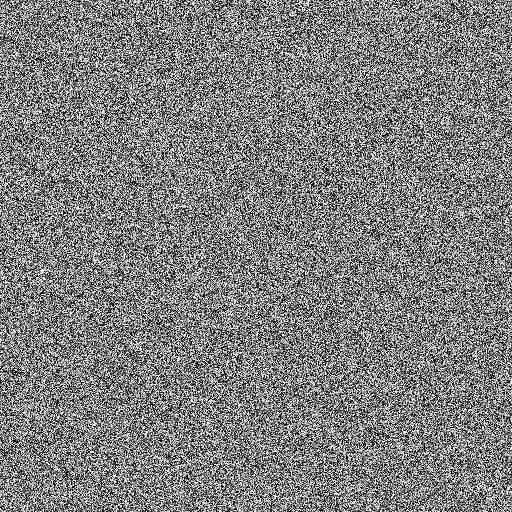
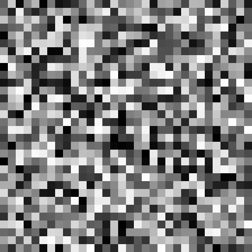
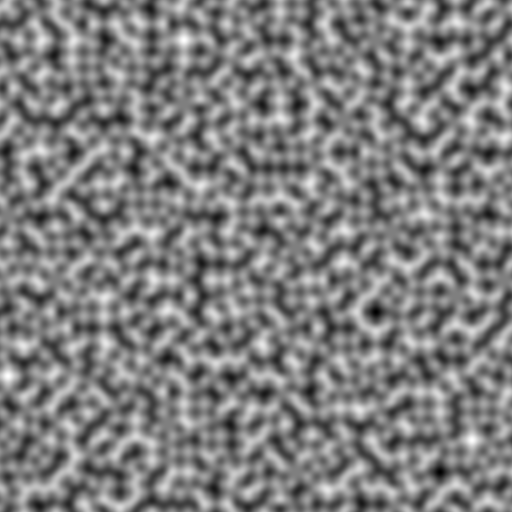
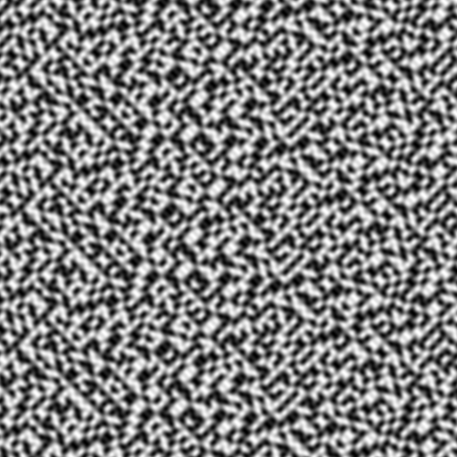
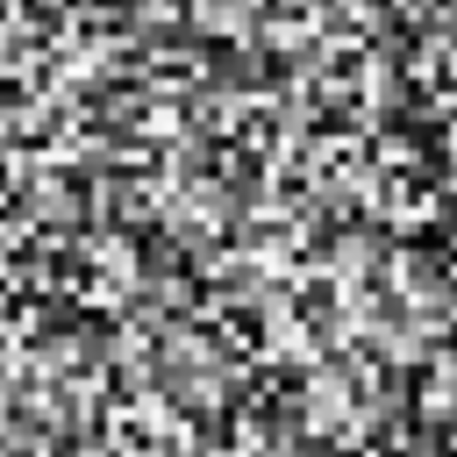
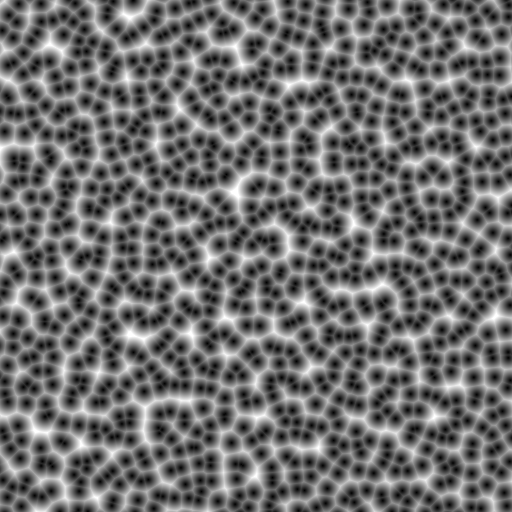
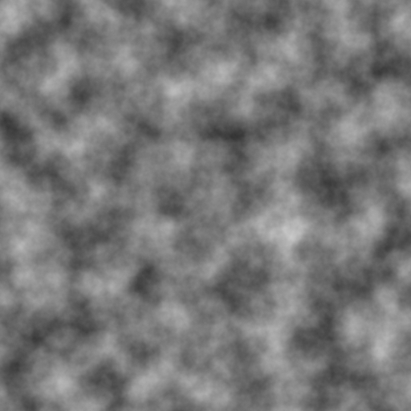
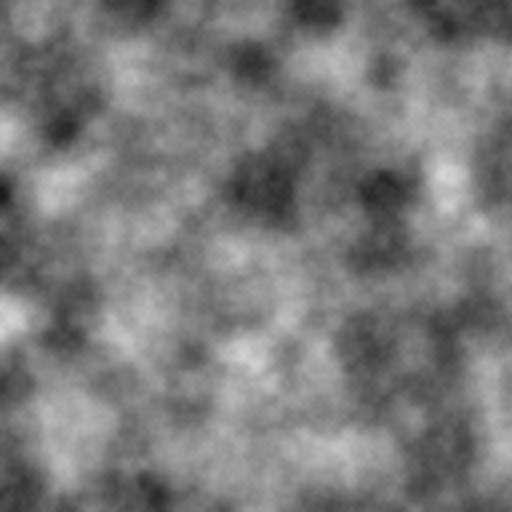

# 噪声图像生成器 Noise Graph Generator
- 最近发现噪声有点好玩😁

# 已实现 implemented
- 白噪声 (White Noise)
- 梯度噪声 (Gradient Noise)
  - 柏林噪声 (Perlin Noise)
  - 单形噪声 (Simplex Noise)
- 值噪声 (Value Noise)
- 沃利噪声/细胞噪声 (Worley Noise/Cell Noise)

# 注
- 程序导出PPM P2格式
- 分形噪声结果
  - 柏林噪声叠加
  - 柏林噪声叠加
